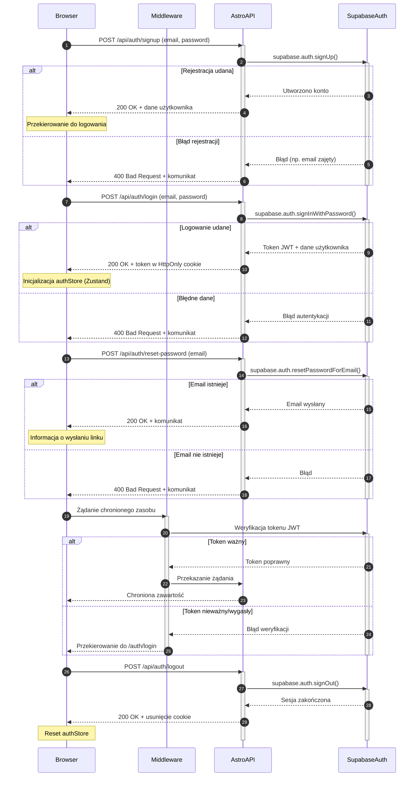

```mermaid
sequenceDiagram
    autonumber
    participant Browser
    participant Middleware
    participant AstroAPI
    participant SupabaseAuth

    %% Rejestracja użytkownika
    Browser->>AstroAPI: POST /api/auth/signup (email, password)
    activate AstroAPI
    AstroAPI->>SupabaseAuth: supabase.auth.signUp()
    activate SupabaseAuth
    alt Rejestracja udana
        SupabaseAuth-->>AstroAPI: Utworzono konto
        AstroAPI-->>Browser: 200 OK + dane użytkownika
        Note over Browser: Przekierowanie do logowania
    else Błąd rejestracji
        SupabaseAuth-->>AstroAPI: Błąd (np. email zajęty)
        AstroAPI-->>Browser: 400 Bad Request + komunikat
    end
    deactivate SupabaseAuth
    deactivate AstroAPI

    %% Logowanie użytkownika
    Browser->>AstroAPI: POST /api/auth/login (email, password)
    activate AstroAPI
    AstroAPI->>SupabaseAuth: supabase.auth.signInWithPassword()
    activate SupabaseAuth
    alt Logowanie udane
        SupabaseAuth-->>AstroAPI: Token JWT + dane użytkownika
        AstroAPI-->>Browser: 200 OK + token w HttpOnly cookie
        Note over Browser: Inicjalizacja authStore (Zustand)
    else Błędne dane
        SupabaseAuth-->>AstroAPI: Błąd autentykacji
        AstroAPI-->>Browser: 400 Bad Request + komunikat
    end
    deactivate SupabaseAuth
    deactivate AstroAPI

    %% Reset hasła
    Browser->>AstroAPI: POST /api/auth/reset-password (email)
    activate AstroAPI
    AstroAPI->>SupabaseAuth: supabase.auth.resetPasswordForEmail()
    activate SupabaseAuth
    alt Email istnieje
        SupabaseAuth-->>AstroAPI: Email wysłany
        AstroAPI-->>Browser: 200 OK + komunikat
        Note over Browser: Informacja o wysłaniu linku
    else Email nie istnieje
        SupabaseAuth-->>AstroAPI: Błąd
        AstroAPI-->>Browser: 400 Bad Request + komunikat
    end
    deactivate SupabaseAuth
    deactivate AstroAPI

    %% Dostęp do chronionej zawartości
    Browser->>Middleware: Żądanie chronionego zasobu
    activate Middleware
    Middleware->>SupabaseAuth: Weryfikacja tokenu JWT
    activate SupabaseAuth
    alt Token ważny
        SupabaseAuth-->>Middleware: Token poprawny
        Middleware->>AstroAPI: Przekazanie żądania
        AstroAPI-->>Browser: Chroniona zawartość
    else Token nieważny/wygasły
        SupabaseAuth-->>Middleware: Błąd weryfikacji
        Middleware-->>Browser: Przekierowanie do /auth/login
    end
    deactivate SupabaseAuth
    deactivate Middleware

    %% Wylogowanie
    Browser->>AstroAPI: POST /api/auth/logout
    activate AstroAPI
    AstroAPI->>SupabaseAuth: supabase.auth.signOut()
    activate SupabaseAuth
    SupabaseAuth-->>AstroAPI: Sesja zakończona
    AstroAPI-->>Browser: 200 OK + usunięcie cookie
    Note over Browser: Reset authStore
    deactivate SupabaseAuth
    deactivate AstroAPI
```
