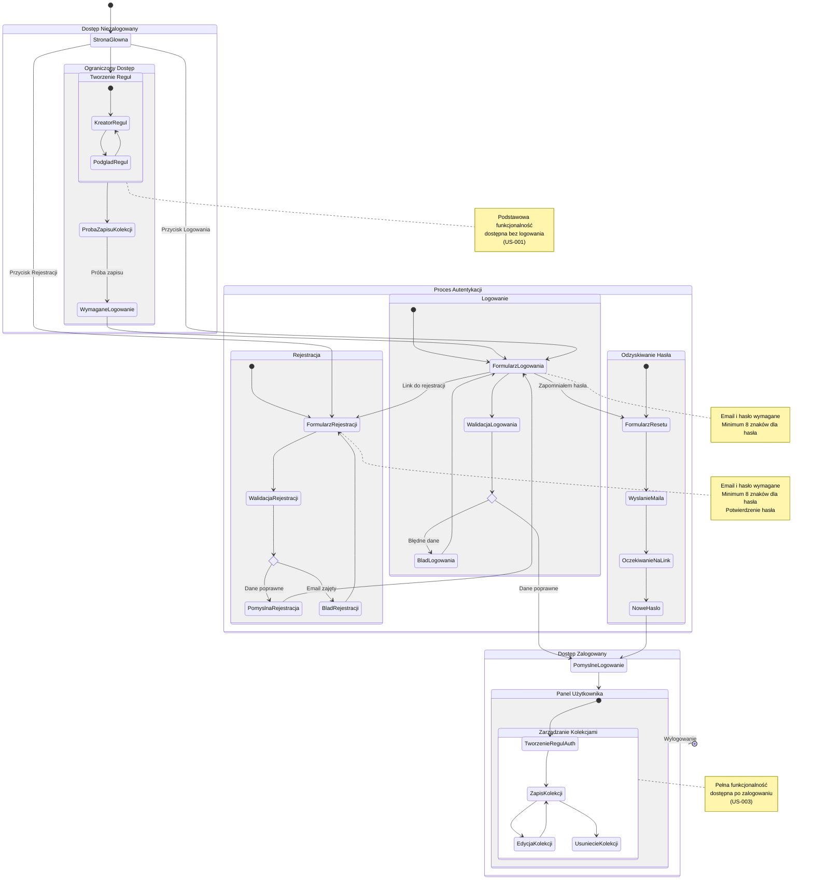

```mermaid
stateDiagram-v2
    [*] --> StronaGlowna

    state "Dostęp Niezalogowany" as Niezalogowany {
        StronaGlowna --> TworzenieRegul
        state "Tworzenie Reguł" as TworzenieRegul {
            [*] --> KreatorRegul
            KreatorRegul --> PodgladRegul
            PodgladRegul --> KreatorRegul
        }

        state "Ograniczony Dostęp" as OgraniczonyDostep {
            TworzenieRegul --> ProbaZapisuKolekcji
            ProbaZapisuKolekcji --> WymaganeLogowanie: Próba zapisu
        }
    }

    state "Proces Autentykacji" as Autentykacja {
        state "Logowanie" as Logowanie {
            [*] --> FormularzLogowania
            FormularzLogowania --> WalidacjaLogowania

            state if_logowanie <<choice>>
            WalidacjaLogowania --> if_logowanie
            if_logowanie --> PomyslneLogowanie: Dane poprawne
            if_logowanie --> BladLogowania: Błędne dane
            BladLogowania --> FormularzLogowania

            note right of FormularzLogowania
                Email i hasło wymagane
                Minimum 8 znaków dla hasła
            end note
        }

        state "Rejestracja" as Rejestracja {
            [*] --> FormularzRejestracji
            FormularzRejestracji --> WalidacjaRejestracji

            state if_rejestracja <<choice>>
            WalidacjaRejestracji --> if_rejestracja
            if_rejestracja --> PomyslnaRejestracja: Dane poprawne
            if_rejestracja --> BladRejestracji: Email zajęty
            BladRejestracji --> FormularzRejestracji

            note right of FormularzRejestracji
                Email i hasło wymagane
                Minimum 8 znaków dla hasła
                Potwierdzenie hasła
            end note
        }

        state "Odzyskiwanie Hasła" as OdzyskiwanieHasla {
            [*] --> FormularzResetu
            FormularzResetu --> WyslanieMaila
            WyslanieMaila --> OczekiwanieNaLink
            OczekiwanieNaLink --> NoweHaslo
            NoweHaslo --> PomyslneLogowanie
        }
    }

    state "Dostęp Zalogowany" as Zalogowany {
        PomyslneLogowanie --> PanelUzytkownika

        state "Panel Użytkownika" as PanelUzytkownika {
            [*] --> TworzenieRegulAuth

            state "Zarządzanie Kolekcjami" as Kolekcje {
                TworzenieRegulAuth --> ZapisKolekcji
                ZapisKolekcji --> EdycjaKolekcji
                EdycjaKolekcji --> ZapisKolekcji
                ZapisKolekcji --> UsuniecieKolekcji
            }
        }
    }

    %% Główne przejścia między stanami
    WymaganeLogowanie --> FormularzLogowania
    StronaGlowna --> FormularzLogowania: Przycisk Logowania
    StronaGlowna --> FormularzRejestracji: Przycisk Rejestracji
    FormularzLogowania --> FormularzRejestracji: Link do rejestracji
    FormularzLogowania --> FormularzResetu: Zapomniałem hasła
    PomyslnaRejestracja --> FormularzLogowania
    PanelUzytkownika --> [*]: Wylogowanie

    note right of TworzenieRegul
        Podstawowa funkcjonalność
        dostępna bez logowania
        (US-001)
    end note

    note right of Kolekcje
        Pełna funkcjonalność
        dostępna po zalogowaniu
        (US-003)
    end note
```
