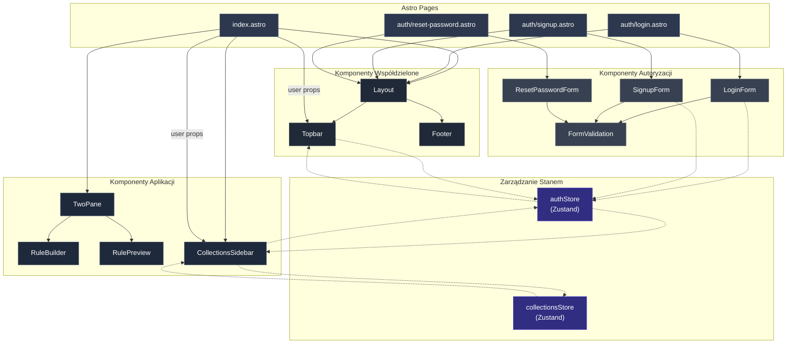

```mermaid
flowchart TD
    %% Style definitions
    classDef astroPage fill:#2d374d,stroke:#64748b,color:#fff
    classDef reactComponent fill:#1e293b,stroke:#475569,color:#fff
    classDef store fill:#312e81,stroke:#4338ca,color:#fff
    classDef auth fill:#374151,stroke:#4b5563,color:#fff
    classDef shared fill:#1f2937,stroke:#374151,color:#fff

    %% Main Layout & Pages
    subgraph "Astro Pages"
        IndexPage["index.astro"]:::astroPage
        LoginPage["auth/login.astro"]:::astroPage
        SignupPage["auth/signup.astro"]:::astroPage
        ResetPage["auth/reset-password.astro"]:::astroPage
    end

    %% Auth Components
    subgraph "Komponenty Autoryzacji"
        LoginForm["LoginForm"]:::auth
        SignupForm["SignupForm"]:::auth
        ResetForm["ResetPasswordForm"]:::auth
        AuthValidation["FormValidation"]:::auth
    end

    %% Shared Components
    subgraph "Komponenty Współdzielone"
        Layout["Layout"]:::shared
        Topbar["Topbar"]:::shared
        Footer["Footer"]:::shared
    end

    %% Main App Components
    subgraph "Komponenty Aplikacji"
        TwoPane["TwoPane"]:::reactComponent
        RuleBuilder["RuleBuilder"]:::reactComponent
        RulePreview["RulePreview"]:::reactComponent
        CollectionsSidebar["CollectionsSidebar"]:::reactComponent
    end

    %% State Management
    subgraph "Zarządzanie Stanem"
        AuthStore["authStore\n(Zustand)"]:::store
        CollectionsStore["collectionsStore\n(Zustand)"]:::store
    end

    %% Connections - Layout Structure
    IndexPage --> Layout
    LoginPage --> Layout
    SignupPage --> Layout
    ResetPage --> Layout

    Layout --> Topbar
    Layout --> Footer

    %% Auth Flow
    LoginPage --> LoginForm
    SignupPage --> SignupForm
    ResetPage --> ResetForm

    LoginForm --> AuthValidation
    SignupForm --> AuthValidation
    ResetForm --> AuthValidation

    %% Main App Structure
    IndexPage --> TwoPane
    TwoPane --> RuleBuilder
    TwoPane --> RulePreview
    IndexPage --> CollectionsSidebar

    %% State Management
    LoginForm -.-> AuthStore
    SignupForm -.-> AuthStore
    Topbar -.-> AuthStore
    CollectionsSidebar -.-> AuthStore
    CollectionsSidebar -.-> CollectionsStore

    %% Data Flow
    AuthStore -.-> Topbar
    AuthStore -.-> CollectionsSidebar
    CollectionsStore -.-> CollectionsSidebar

    %% Props Flow
    IndexPage --> |"user props"| Topbar
    IndexPage --> |"user props"| CollectionsSidebar
```
