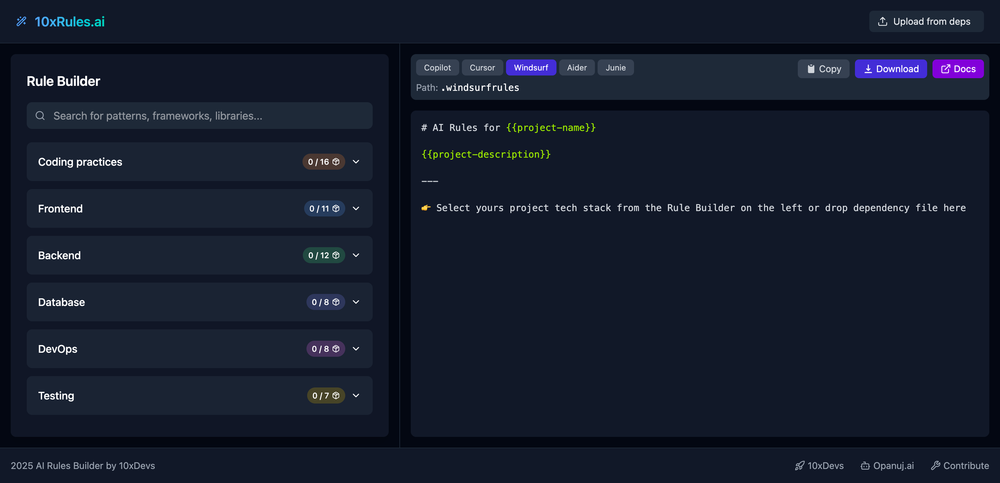

# 10xRules.ai by 10xDevs

<!-- ALL-CONTRIBUTORS-BADGE:START - Do not remove or modify this section -->
[](#contributors-)
<!-- ALL-CONTRIBUTORS-BADGE:END -->

[](https://github.com/przeprogramowani/ai-rules-builder/actions/workflows/master.yml)



👉 [10xRules.ai](https://10xrules.ai)

This is a web application that enables developers to quickly create so called "rules for AI" used by tools such as GitHub Copilot, Cursor and Windsurf, through an interactive, visual interface.

## Features

- **Build AI Rules:** Create customized rule sets for different editors (Copilot, Cursor, Windsurf)
- **Export Options:** Easily copy to clipboard or download as markdown files
- **Smart Import:** Automatically generate rules by dropping package.json or requirements.txt files

## Getting Started

1. **Installation**

   ```bash
   npm install
   ```

2. **Development**

   ```bash
   npm run dev
   ```

3. **Build**
   ```bash
   npm run build
   ```

## Tech Stack

- Astro 5
- TypeScript 5
- React 18.3
- Tailwind 4
- Zustand
- Lucide React

## Contributions

Send updates to:

- `src/data/dictionaries.ts`
- `src/data/rules/...`

## How to Write Effective Rules

When contributing new rules, please:

- **Be specific:** "Use React.memo for expensive components" not "Optimize components"
- **Make it actionable:** Provide clear guidance that can be immediately applied
- **Include placeholders:** Use `{{placeholder_text}}` for project-specific values
- **Follow conventions:** Match the style and structure of existing rules
- **Focus on best practices:** Rules should represent industry standards, not personal preferences

See examples in `src/data/rules/` directory for each technology stack.

---

[10xDevs](https://10xdevs.pl) - launching soon 🚀

## Contributors ✨

Thanks goes to these wonderful people ([emoji key](https://allcontributors.org/docs/en/emoji-key)):

<!-- ALL-CONTRIBUTORS-LIST:START - Do not remove or modify this section -->
<!-- prettier-ignore-start -->
<!-- markdownlint-disable -->
<table>
  <tbody>
    <tr>
      <td align="center" valign="top" width="14.28%"><a href="https://github.com/damianidczak"><br /><sub><b>Damian</b></sub></a><br /><a href="https://github.com/przeprogramowani/ai-rules-builder/commits?author=damianidczak" title="Code">💻</a></td>
      <td align="center" valign="top" width="14.28%"><a href="https://github.com/pawel-twardziak"><br /><sub><b>pawel-twardziak</b></sub></a><br /><a href="https://github.com/przeprogramowani/ai-rules-builder/commits?author=pawel-twardziak" title="Code">💻</a></td>
    </tr>
  </tbody>
</table>

<!-- markdownlint-restore -->
<!-- prettier-ignore-end -->

<!-- ALL-CONTRIBUTORS-LIST:END -->

This project follows the [all-contributors](https://github.com/all-contributors/all-contributors) specification. Contributions of any kind welcome!
