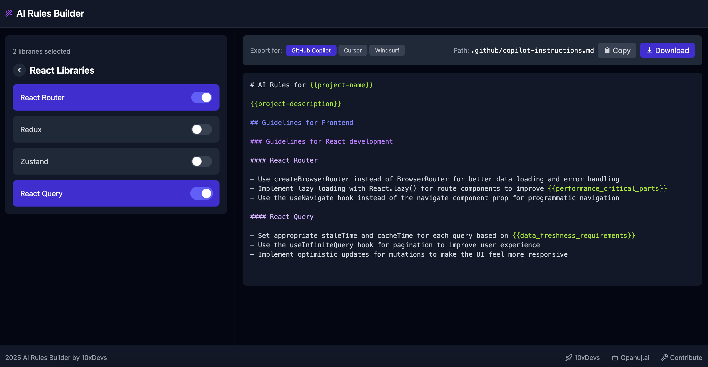

# 10xRules.ai by 10xDevs



👉 [10xRules.ai](https://10xrules.ai)

This is a web application that enables developers to quickly create so called "rules for AI" used by tools such as GitHub Copilot, Cursor and Windsurf, through an interactive, visual interface.

## Features

- **Build AI Rules:** Create customized rule sets for different editors (Copilot, Cursor, Windsurf)
- **Export Options:** Easily copy to clipboard or download as markdown files
- **Smart Import:** Automatically generate rules by dropping package.json or requirements.txt files

## Getting Started

1. **Installation**

   ```bash
   npm install
   ```

2. **Development**

   ```bash
   npm run dev
   ```

3. **Build**
   ```bash
   npm run build
   ```

## Tech Stack

- Astro 5
- TypeScript 5
- React 18.3
- Tailwind 4
- Zustand
- Lucide React

## Contributions

Send updates to:

- `src/data/dictionaries.ts`
- `src/data/rules/...`

When contributing new rules, please follow the existing format in the corresponding files and ensure your rules are specific, actionable, and follow best practices.

---

[10xDevs](https://10xdevs.pl) - launching soon 🚀
